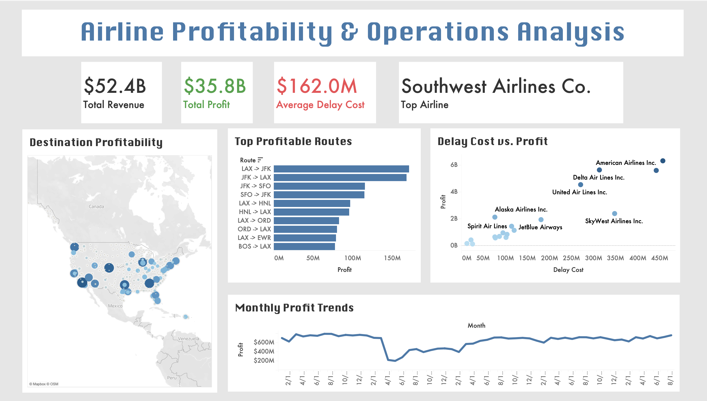

[Data Set](https://www.kaggle.com/datasets/patrickzel/flight-delay-and-cancellation-dataset-2019-2023)

# Airline Profitability & Operations Dashboard
Financial and operational analytics project using Python, Pandas, and Tableau to analyze 3M+ U.S. airline flight records and model airline profitability through estimated revenue, fuel costs, delay penalties, and route performance metrics.

## Features
- Analyzed 3M+ airline flight records from 2019–2023.
- Engineered financial metrics including estimated revenue, fuel cost, delay cost, and flight profit.
- Built interactive Tableau dashboards with KPI cards, profitability trends, scatterplots, route analysis, and geographic destination maps.
- Identified top-performing airlines and most profitable flight routes using operational and financial analysis.
- Created time-series monthly profit trend analysis for executive-style reporting and business insights.

## Technologies
- Data Analysis: Python, Pandas, NumPy
- Data Visualization: Tableau Public
- Financial Modeling: Revenue estimation, operational cost modeling, profitability analysis

## Dashboard

[Tableau Link](https://public.tableau.com/app/profile/rehma.uzair/viz/Book1_17773240510540/AirlineProfitabilityOperationsAnalysis?publish=yes)

